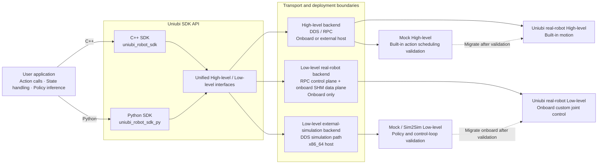

# uniubi_robot_mock

**English** | [简体中文](README_zh.md)

This repository enables SDK-based HighLevel and LowLevel motion development
and validation in a simulated environment without a physical robot. The
simulation uses the same SDK interfaces as real hardware, so validated client
code can be migrated to a robot with minimal API changes. The transport and
deployment topology still change: real-robot LowLevel control is onboard only,
while external x86_64 LowLevel use selects the simulation backend.

> **Simulation limitations:** Simulation behavior is not equivalent to
> real-hardware behavior. The simulator implements only a subset of the
> capabilities available on a physical robot, so motion performance, supported
> features, timing, and safety behavior must be validated again on hardware.

## Installation

1. **Mock services (HighLevel only):** deploy
   [mockService/uniubi_mock/](mockService/uniubi_mock/) by following the
   [runtime guide](docs/mock_service.md). LowLevel skips this step.
2. **Shared environment:** install the MuJoCo simulation dependencies, public
   Python SDK, and matching SDK native libraries by following the
   [SDK Sim2Sim guide](docs/sim2sim_sdk.md#install).

For a standalone host preparation checklist, see
[Robot Simulation Environment Setup](docs/simulation_setup.md).

## HighLevel

HighLevel requires the mock services and MuJoCo bridge. Use
[highlevel_console.py](simulation/scripts/highlevel_console.py) to validate
configured action scheduling and action parameters. See
[HighLevel SDK Validation](docs/sim2sim_sdk.md#highlevel-sdk-validation) for the
startup and test procedure.

### Supported Actions

Current mock runtime supports:

- `laying`
- `standing`
- `walking`
- `emergencyStop`
- `waveHand`
- `bipedStand`
- `handstand`
- `leftSideStand`
- `rightSideStand`

The runtime also uses the internal `recovery` action automatically after a
supported action reports a fall. It is not exposed as a user-startable action.

Biped stand actions are persistent. To return to Walking from the HighLevel
console, call `stop`, confirm that `state` reports `walking`, and then send
Walking velocity parameters.

## LowLevel

LowLevel does not require the mock services. Use
[run_lowlevel_onnx_policy.py](simulation/scripts/run_lowlevel_onnx_policy.py) to
validate observations, bundled ONNX inference, and 12-joint PD targets. See
[LowLevel SDK Validation](docs/sim2sim_sdk.md#lowlevel-sdk-validation) for the
startup and test procedure.

## Compatibility Notes

- Target runtime platform: Linux `x86_64`.
- Recommended OS: Ubuntu 22.04 LTS.
- DDS: Cyclone DDS 0.10.5.
- Simulator bridge: MuJoCo is the only supported simulation backend.
- The mock runtime is for SDK integration and closed-loop simulation validation. It does not replace real robot safety validation.

See the [Support Matrix](support_matrix.md) for the complete compatibility boundary.

## License

Original UniUbi code and documentation in this repository are licensed under the Apache License 2.0. See [LICENSE](LICENSE) and [NOTICE](NOTICE).
