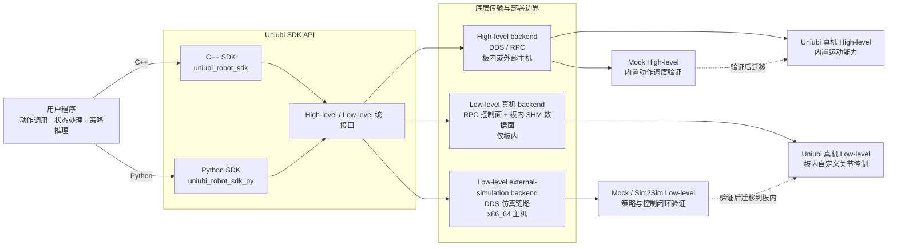

# uniubi_robot_mock

[English](README.md) | **简体中文**

本仓库用于在没有真实机器人的情况下，通过 SDK 在仿真环境中开发和验证 HighLevel
与 LowLevel 运控功能。仿真与真实硬件保持相同的 SDK 接口，验证完成的客户端代码可
用最小 API 改动快速迁移到真实机器人，但底层传输和部署拓扑会变化：LowLevel 真机控制
仅支持板内部署，外部 x86_64 主机上的 LowLevel 使用仿真 backend。

> **仿真限制：**仿真表现不等同于真机表现，且仿真环境只实现了真实机器人能力的
> 一个子集，支持的功能和动作没有真机丰富。动作效果、时序、安全行为及相关功能均需
> 在真实硬件上重新验证。

## 安装

1. **mock 服务（仅 HighLevel）：**按照 [mock 服务说明](docs/mock_service_zh.md)部署
   [mockService/uniubi_mock/](mockService/uniubi_mock/)。LowLevel 跳过这一步。
2. **公共环境：**按照 [SDK Sim2Sim 指南](docs/sim2sim_sdk_zh.md#安装)安装 MuJoCo
   仿真依赖、公开 Python SDK 和同版本 SDK 动态库。

独立主机的环境准备清单见[机器人仿真环境配置](docs/simulation_setup_zh.md)。

## HighLevel

HighLevel 需要 mock 服务和 MuJoCo bridge。使用
[highlevel_console.py](simulation/scripts/highlevel_console.py)验证已配置动作的调度和
动作参数。启动及测试步骤见
[HighLevel SDK 验证](docs/sim2sim_sdk_zh.md#highlevel-sdk-验证)。

### 支持动作

当前 mock runtime 支持：

- `laying`
- `standing`
- `walking`
- `emergencyStop`
- `waveHand`
- `bipedStand`
- `handstand`
- `leftSideStand`
- `rightSideStand`

当已支持动作上报跌倒时，运行时还会自动使用内部 `recovery` 动作；该动作不作为用户可主动启动的动作暴露。

双足站类动作是持续动作。通过 HighLevel console 返回 Walking 时，应先执行 `stop`，
并用 `state` 确认当前动作已经是 `walking`，再下发 Walking 速度参数。

## LowLevel

LowLevel 不需要 mock 服务。使用
[run_lowlevel_onnx_policy.py](simulation/scripts/run_lowlevel_onnx_policy.py)验证直接
观测、内置 ONNX 推理和 12 关节 PD 目标。启动及测试步骤见
[LowLevel SDK 验证](docs/sim2sim_sdk_zh.md#lowlevel-sdk-验证)。

## 兼容性说明

- 目标运行平台：Linux `x86_64`。
- 推荐系统：Ubuntu 22.04 LTS。
- DDS：Cyclone DDS 0.10.5。
- 仿真 bridge：MuJoCo 是唯一支持的仿真后端。
- 本仓用于 SDK 集成和仿真闭环验证，不替代真机安全验证。

完整兼容性边界见[支持矩阵](support_matrix_zh.md)。

## 许可证

本仓库中的 UniUbi 原创代码和文档使用 Apache License 2.0。详见 [LICENSE](LICENSE) 和 [NOTICE](NOTICE)。
